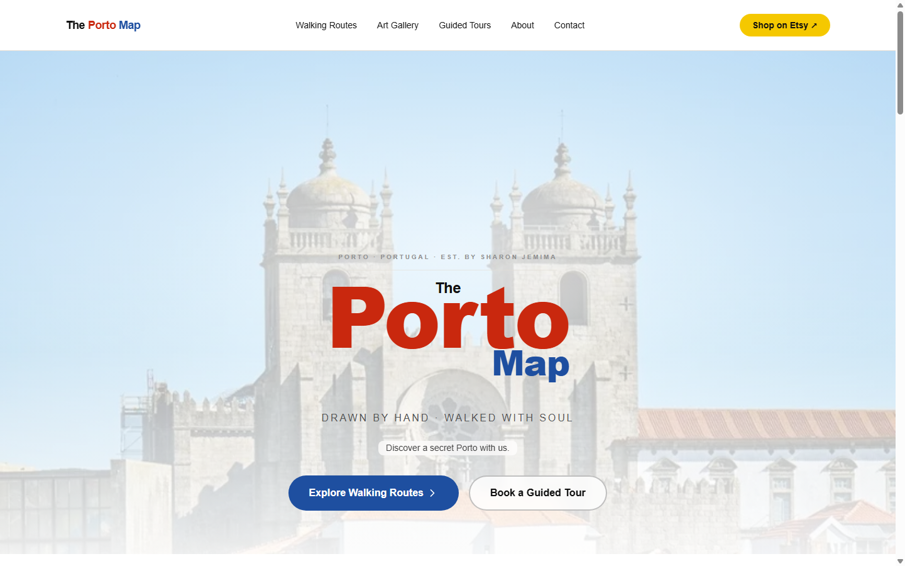
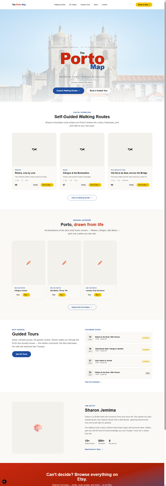

# 🗺️ The Porto Map

> Hand-drawn maps, self-guided walking routes and intimate guided tours of Porto — created by artist Sharon Jemima.

[](https://nextjs.org/)
[](https://typescriptlang.org/)
[](https://tailwindcss.com/)
[](https://react.dev/)

---

## Screenshots

**Hero**



**Full homepage**



---

## About

**The Porto Map** is a solar, paper-and-ink brand for a one-woman creative business in Porto, Portugal. Sharon Jemima draws original ink illustrations of the city, writes hand-drawn self-guided walking route scripts sold as digital downloads, and leads small guided walking tours through the neighbourhoods she actually knows.

This repository is the marketing site for that business: a catalogue for the walking routes, a gallery for the artwork, and a booking-adjacent page for the guided tours — all built as a single, deliberately lightweight Next.js application.

### Brand identity

| Element | Description |
|---|---|
| **Name** | The Porto Map |
| **Artist / voice** | Sharon Jemima — British artist based in Porto |
| **Products** | Self-guided walking route scripts (digital download), original ink/watercolour art prints, small-group guided tours |
| **Sales channel** | Etsy shop (routes and prints), direct contact (tours) |
| **Tone** | Warm, personal, hand-drawn — "no generic scripts" |

---

## Tech Stack

| Layer | Technology |
|---|---|
| **Framework** | Next.js 16 (App Router, React Server Components) |
| **Language** | TypeScript 5 (strict mode) |
| **Styling** | Tailwind CSS 4 via CSS custom properties (`@theme inline`) |
| **Icons** | Lucide React |
| **Data** | Local mock data module (no external database) |
| **Deploy** | Vercel |

This stack is intentionally simple: there is no CMS, no auth, and no database. Content (routes, art pieces, tours, dates) lives in a typed mock-data module and is read through a small async data-access layer, so a real backend can be swapped in later without touching any page or component.

---

## Design System

Palette: **white / paper / cream backgrounds** with a **Porto tricolour** accent system — no dark mode, no neon; a minimalist, sunlit, analog feel.

| Token | Value | Use |
|---|---|---|
| `--background` | `#FFFFFF` | Page background |
| `--surface` | `#FAF9F6` | Card / section background |
| `--surface-elevated` | `#F3E8DC`-ish | Image placeholders |
| `--foreground` | `#111111` | Body text |
| `--red` / `--red-dark` | `#C9280E` / `#A82008` | Primary brand accent ("Porto") |
| `--yellow` / `--yellow-dark` | `#F5C800` / `#D4A900` | Etsy / CTA accent |
| `--blue` / `--blue-dark` | `#1E4FA0` / `#153880` | Secondary accent ("Map"), primary buttons |

Typography is the system Helvetica stack (`"Helvetica Neue", Helvetica, Arial, sans-serif`) — no webfont is loaded.

The homepage wordmark lockup ("The" / "Porto" / "Map") follows the nav logo's colour split — black / red / blue — with "Map" tucked into the lower-right of "Porto", echoing the hand-lettered, slightly imperfect feel of the brand.

---

## Project Structure

```
src/
├── app/
│   ├── layout.tsx        # Root layout — Header + Footer, global metadata
│   ├── page.tsx          # Home — hero, featured routes/art/tours, about strip
│   ├── globals.css       # Design tokens (Tailwind v4 @theme inline)
│   └── favicon.ico
├── components/
│   ├── layout/            # Header (nav + mobile menu), Footer
│   ├── home/               # HeroSkyline — original SVG illustration
│   ├── routes/             # RouteCard
│   ├── art/                # ArtCard
│   └── tours/               # TourCard
├── lib/
│   ├── data.ts            # Async data-access layer (getRoutes, getArtPieces, getTours, …)
│   └── mock-data.ts        # Walking routes, art pieces, collections, tours, tour dates, site settings
└── types/
    └── index.ts            # WalkingRoute, ArtPiece, Collection, GuidedTour, TourDate, SiteSettings

public/
└── images/                 # Hero imagery
```

---

## Content Model

| Type | Fields (selected) | Notes |
|---|---|---|
| `WalkingRoute` | title, subtitle, distance_km, duration_hours, difficulty, neighbourhood, price, etsy_listing_url | Self-guided digital downloads |
| `ArtPiece` | title, medium (ink / watercolour / mixed), collection, etsy_listing_url | Grouped into `Collection`s (e.g. "Porto Landmarks") |
| `GuidedTour` | name, tagline, duration_hours, max_participants, price_per_person, meeting_point, highlights | Small-group tours |
| `TourDate` | tour_slug, date, time, spots_remaining, status | Upcoming schedule shown on the homepage |
| `SiteSettings` | tagline, hero_subtitle, etsy_shop_url, instagram_url | Singleton, mirrors the original site's admin-managed settings |

---

## Getting Started

### Prerequisites

- Node.js 18+
- npm

### Installation

```bash
npm install
```

### Development

```bash
npm run dev
```

Open [http://localhost:3000](http://localhost:3000).

### Build

```bash
npm run build
npm start
```

---

## Architecture Decisions

- **Server Components by default** — pages are RSC; `"use client"` is used only where interactivity is required (the mobile nav menu in `Header`).
- **Mock-data-first** — `lib/data.ts` exposes async functions (`getRoutes`, `getArtPieces`, `getTours`, `getUpcomingDates`, …) that currently read from `lib/mock-data.ts`. The async boundary is deliberate: swapping in a real database later only means changing the implementation of these functions.
- **No external image hosting** — all hero imagery is served locally from `public/images/`, rather than hotlinked from a third party.
- **Original illustration over stock photography** — `HeroSkyline` is a hand-built SVG skyline (rooftops, sky gradient) used as a fallback/alternate hero treatment, keeping the option to run the whole hero without any raster image dependency.
- **CSS variables + Tailwind v4** — palette and design tokens are defined once in `globals.css` and consumed via `@theme inline`, so the brand palette can be re-themed from a single file.

---

## Current Status

Implemented:

- ✅ Root layout, global metadata, Header/Footer
- ✅ Homepage — hero, featured walking routes, art gallery preview, guided tours + upcoming dates, about strip, Etsy CTA

Not yet built (nav links exist but the routes are pending):

- ⬜ `/routes` — full walking routes catalogue + detail pages
- ⬜ `/art` — full gallery + detail pages, collection filtering
- ⬜ `/tours` — full tours catalogue + detail pages
- ⬜ `/about` — Sharon's full bio page
- ⬜ `/contact` — contact form (no backend/email service wired up yet by design)

---

## License

This project is proprietary. All rights reserved.
